# Multi-Agentic Fitness Tracker System Architecture

```mermaid
graph LR
    FTA[🤖 fitness_tracker_agent]
    
    subgraph Loop1["robust_data_collector<br/>(Loop Agent)"]
        DC[🤖 data_collector]
        DV[🤖 data_validator]
        GAT[🔧 garmin_api]
        DC --> DV
        DC --> GAT
    end
    
    subgraph Loop2["robust_analyzer<br/>(Loop Agent)"]
        AN[🤖 analyzer]
        PD[🤖 pattern_detector]
        TC[🔧 trend_calc]
        AN --> PD
        AN --> TC
    end
    
    subgraph Loop3["robust_insight_gen<br/>(Loop Agent)"]
        IG[🤖 insight_gen]
        RE[🤖 recommender]
        IV[🤖 validator]
        IG --> RE
        IG --> IV
    end
    
    QA[🤖 qa_agent]
    GT[🤖 goal_tracker]
    AL[🤖 learning_agent]
    
    DST[🔧 storage]
    FCT[🔧 calculator]
    VT[🔧 viz]
    MM[🔧 memory]
    
    FTA --> Loop1
    FTA --> Loop2
    FTA --> Loop3
    FTA --> QA
    FTA --> GT
    FTA --> AL
    FTA --> DST
    FTA --> FCT
    FTA --> VT
    FTA --> MM
    
    style FTA fill:#4CAF50,stroke:#2E7D32,stroke-width:3px,color:#FFFFFF
    style Loop1 fill:#F5F5F5,stroke:#424242,stroke-width:2px,color:#000000
    style Loop2 fill:#F5F5F5,stroke:#424242,stroke-width:2px,color:#000000
    style Loop3 fill:#F5F5F5,stroke:#424242,stroke-width:2px,color:#000000
    style DC fill:#FFFFFF,stroke:#212121,stroke-width:1px,color:#000000
    style DV fill:#FFFFFF,stroke:#212121,stroke-width:1px,color:#000000
    style AN fill:#FFFFFF,stroke:#212121,stroke-width:1px,color:#000000
    style PD fill:#FFFFFF,stroke:#212121,stroke-width:1px,color:#000000
    style IG fill:#FFFFFF,stroke:#212121,stroke-width:1px,color:#000000
    style RE fill:#FFFFFF,stroke:#212121,stroke-width:1px,color:#000000
    style IV fill:#FFFFFF,stroke:#212121,stroke-width:1px,color:#000000
    style GAT fill:#E3F2FD,stroke:#1976D2,stroke-width:1px,color:#000000
    style TC fill:#E3F2FD,stroke:#1976D2,stroke-width:1px,color:#000000
    style QA fill:#FFFFFF,stroke:#212121,stroke-width:1px,color:#000000
    style GT fill:#FFFFFF,stroke:#212121,stroke-width:1px,color:#000000
    style AL fill:#FFFFFF,stroke:#212121,stroke-width:1px,color:#000000
    style DST fill:#E3F2FD,stroke:#1976D2,stroke-width:1px,color:#000000
    style FCT fill:#E3F2FD,stroke:#1976D2,stroke-width:1px,color:#000000
    style VT fill:#E3F2FD,stroke:#1976D2,stroke-width:1px,color:#000000
    style MM fill:#E3F2FD,stroke:#1976D2,stroke-width:1px,color:#000000
```

## Architecture Components

### Main Agent
- **fitness_tracker_agent**: Central orchestrator that coordinates all sub-agents and tools

### Loop Agents (Robust Processing with Validation)

1. **robust_data_collector (Loop Agent)**
   - `data_collector`: Fetches data from Garmin Connect API
   - `data_validator`: Validates and cleans incoming data
   - `garmin_api_tool`: Tool for interacting with Garmin API

2. **robust_analyzer (Loop Agent)**
   - `analyzer`: Processes fitness metrics and activities
   - `pattern_detector`: Identifies patterns and trends
   - `trend_calculator`: Calculates statistical trends over time

3. **robust_insight_generator (Loop Agent)**
   - `insight_generator`: Creates personalized insights
   - `recommendation_engine`: Generates fitness recommendations
   - `insight_validator`: Validates quality and relevance of insights

### Specialized Agents

- **question_answering_agent**: Handles user queries about fitness data
- **goal_tracking_agent**: Monitors progress toward fitness goals
- **adaptive_learning_agent**: Learns from user patterns and adapts recommendations

### Tools

- **data_storage_tool**: Manages data persistence
- **fitness_calculator_tool**: Performs fitness-related calculations
- **visualization_tool**: Generates charts and graphs
- **memory_manager**: Manages session and long-term memory

